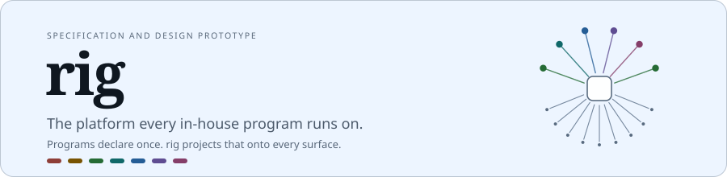
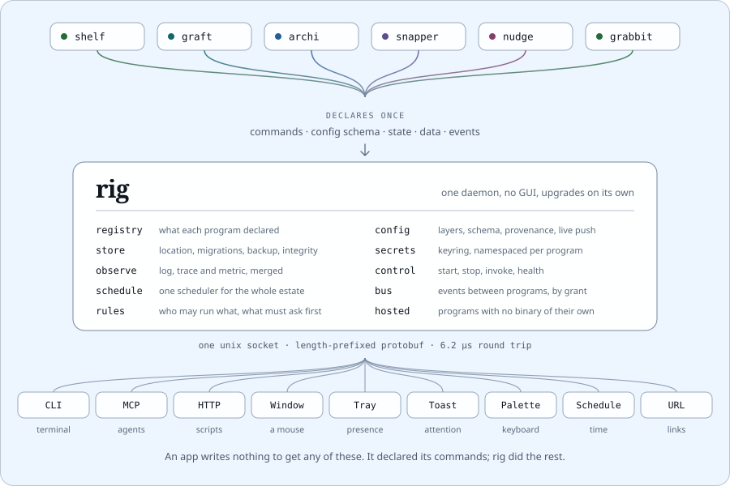

<div align="center">

<picture>
  <source media="(prefers-color-scheme: dark)" srcset="design/readme/banner-dark.svg">
  
</picture>

</div>

## What it is

Every program in the estate needs the same infrastructure: configuration,
storage, secrets, logging, tracing, notifications, a window, a tray. Today each
one carries its own copy, badly. rig supplies all of it from a single daemon,
and controls the programs as well: starting, stopping, invoking, scheduling and
wiring them to each other.

**No program imports rig.** They talk to it over a unix socket. That is the
whole point. rig upgrades on its own, and every program gets the improvement
without being rebuilt.

## The idea, in one line

**An app declares what it can do, once. rig projects that onto every way anyone
might reach it.**

<picture>
  <source media="(prefers-color-scheme: dark)" srcset="design/readme/projection-dark.svg">
  
</picture>

The bottom row is free. A program writes nothing to get a CLI subcommand, an MCP
tool, a tray entry, a schedulable job or a button inside a notification. It
declared its commands; rig did the rest.

And it compounds. Add a surface to rig in 2028, a voice interface or a phone
app, and every program already has it without being touched.

## Where this is

**A specification, plus the two pieces that had to be proven before writing it.**
There is no daemon yet. `PLAN.md` is the whole design at 2300 lines, ordered
into seventeen milestones, and it is what the rest of this repo exists to
support.

| Piece | State |
|---|---|
| `PLAN.md` | Complete. Architecture, wire protocol, capability model, isolation, the conformance suite, the milestone order |
| `design/` | Built. A live, self-contained visual system with a theme engine that measures its own contrast |
| `ipcbench/` | Built and measured. The transport numbers the daemon architecture rests on |
| `cmd/rigd`, `cmd/rig` | Not started. Milestone M0 |

## Measured before it was designed

The daemon shape only works if a socket round trip is cheap. Taken on one
laptop, 2026-09-10, Go 1.27.1, two real processes:

| Transport | Per operation | Rate |
|---|---|---|
| Direct Go function call, what an imported library gives you | 0.6 ns | 1.6G/s |
| Unix socket round trip, 64 B | **6.2 µs** | 161k/s |
| Unix socket round trip, 4 KB | 7.8 µs | 128k/s |
| Unix socket round trip, 64 KB | 19.0 µs | 53k/s |
| Round trip with JSON encode and decode, 81 B | 11.4 µs | 87k/s |
| One-way write, 256 B log record | **561 ns** | 1.8M/s |
| Shared memory, spin-wait round trip | 143 ns | 7.0M/s |

Three decisions fell out of that table:

- **The daemon costs nothing that matters.** A config read, a notification, a
  command invocation, a health check, thousands of times over at 6 µs, is noise.
- **Logging does not need shared memory.** A plain socket write sustains 1.8M
  records per second. Nothing here will produce a thousandth of that. Shared
  memory is 43x faster and stays unbuilt until a workload asks for it.
- **gRPC is not bought.** Its server on a unix socket measured **+9.80 MiB
  resident** for HTTP/2 framing a local socket does not need. Protobuf stays,
  hand-framed behind a length prefix.

Re-take them on your own machine with `make bench-ipc`. The absolute numbers
move with the hardware and the load; the ratios the decisions rest on do not.

## The visual system

`design/visual-system.html` is one self-contained file. Open it in a browser:
pick a program in the rail, fire a toast, watch a pane crash and recover, then
open **Lab** and drag any visual parameter of the product while the contrast
table re-measures live.

Two rules the theme engine enforces, so that a tweak cannot quietly break
legibility:

**Hues are generated in oklch.** Six evenly spaced at one lightness and one
chroma, so "a family" is arithmetic rather than a promise. Move the lightness
and all six move together and stay a family.

**Neutrals are solved, not chosen.** `--border`, `--fg-dim` and `--fg-faint` are
binary-searched to the dimmest value that still clears their WCAG target on
*every* surface they can land on. The inherited `#556579` border measured 2.40:1
on a panel, and is now not something anyone can type.

The banner and diagram above are generated from that same engine by
`design/readme-art.mjs`, which is why their colours are the product's colours
and not an approximation of them.

## Layout

```
PLAN.md              the specification: 33 sections, 17 milestones
design/              the visual system, live in one HTML file
  theme.js             the engine: a small config object to the whole token set
  visual-system.src.html   markup and CSS. Edit this, not the built file
  build.py             inlines the scripts into visual-system.html
  readme-art.mjs       the artwork on this page
ipcbench/            the transport benchmark behind the table above
tools/contrast.py    WCAG measurement used by the gates
Makefile             the targets the milestones are demonstrated with
```

## Non-goals

- rig does not run business logic. A program id appearing in rig's code is a bug.
- rig is not required. Every program still works without it, at reduced service.
- rig does not replace a program's own CLI. `shelf` still works as `shelf`.
- rig does not own data. Programs own their data; rig owns the plumbing around it.
- rig does not hot-upgrade itself. Measured at 1.9 ms of benefit against four
  defect classes. Notice, restart, resume.
- rig does not host anything we did not write. Third-party code is a separate
  process, or it is not run.

## The name

A rig is a platform. A rig is your whole setup. Rigging is the ropes and tackle
that control a ship. To rig up is to assemble. Four meanings, all correct.
